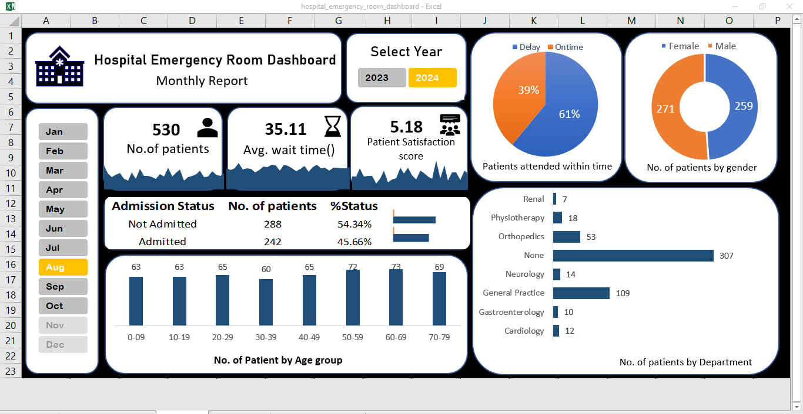

#Hospital Emergency Room Dashboard

This project is a dynamic Excel dashboard created to monitor Emergency Room(ER) performance.

# 🏥 Hospital Emergency Room Dashboard (Excel)

This project features an **interactive Excel dashboard** designed to track and analyze key performance indicators (KPIs) from a hospital's emergency room (ER). Built using **PivotTables, Charts, Slicers, and Power Query**, it enables interactive analysis with visual drill-down capability.

---

## 📊 Key Features

- 🎯 **KPIs Tracked**:
  - **Number of Patients**: Daily count of ER visits, visualized using area sparklines
  - **Average Wait Time**: Tracks patient wait time trends with highlight on delays
  - **Patient Satisfaction Score**: Monitors service quality over time

- 📌 **Interactive Slicers**: Filter by **Month** and **Year**
- 📈 **Area Sparkline Navigation**: Clicking a mini chart opens a full chart sheet for detailed analysis
- ⚙️ **Power Query**: Used to clean and reshape raw data before analysis
- 📊 **Charts Used**: Area, Bar, Column, Pie (for age group, gender, delay status, departments, etc.)
- 🧑‍🤝‍🧑 **Demographic Insights**: Breakdown by gender, age group, and department

---

## 🗂️ File Structure

| File Name                            | Description                                  |
|-------------------------------------|----------------------------------------------|
| `hospital_emergency_room_dashboard.xlsx` | Main dashboard with interactivity and charts |
| `README.md`                         | Project overview and instructions             |

---

## 📷 Preview

---
## 🔧 Built With

- Microsoft Excel (2016)
- Pivot Tables & Pivot Charts
- Power Query
- Slicers for interactivity
- Custom navigation using shapes + sheet linking

---

## 💡 How It Works

- The **dashboard** sheet contains KPIs with mini area charts.
- When a user **clicks on any KPI’s area chart**, it links to a **detailed chart** in another sheet.
- All charts auto-update based on **slicer selections** (Month, Year).
- Power Query transforms the raw source data into clean tables for analysis.

---

## 🚀 Getting Started

1. Clone or download this repository.
2. Open the Excel file.
3. Use slicers to explore patterns across months/years.
4. Click on a mini chart (e.g., No. of Patients) to view full detailed chart.

---

## 👤 Author

**Pujitha Dumpa**  
🎓 CSE Engineering Student | 📊 Aspiring Data Analyst  

---

